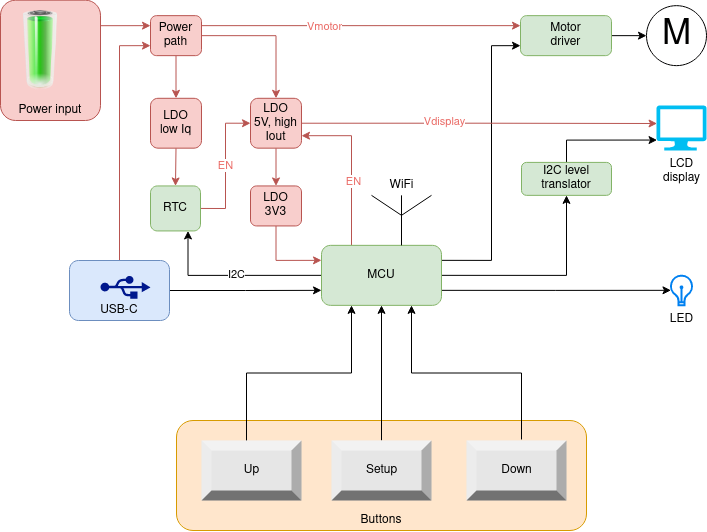

# chickenguard-2019-upgrade

Open-source replacement for the electronics of the [ChickenGuard](https://www.chickenguard.be/), an automatic chicken door opener.

## Added features, not present in original ChickenGuard
* Open source, so you can easily repair it yourself.  No epoxy covered PCBs.
* Will stop the door when blocked (e.g. by a chicken) (this feature is only present in most recent versions of the ChickenGuard).
* Automatic configuration of the door position.
* Web interface for configuration.
  * Time and date set automatically correctly from the smartphone.
  * Easy setup of fixed times for opening and closing the door.
  * Automatic setup of sunrise and sunset times, based on geolocation.
  * To save costs, the LCD display can be removed, and the device can be configured via the smartphone.
  * Future firmware upgrade might allow integration with home automation systems.
* USB-C port for power and programming.
* RoHS compliant (no CdS light sensor).

## [Use cases](./use-cases.md)

## Documentation

* [Product Requirement Document](./docs/PRD.md)

## Revision history
### Revision 1.1 : Using an external RTC
  * PCB cost reduction : layer count reduced from 4 to 2.
  * [Concept](./docs/R1.1/concept.md)
  * [Technical study](./docs/R1.1/technical-study_1.1.ipynb)

### Revision 1.0 : Using the internal RTC of the ESP32
  * PCB design created, but never manufactured
  * [Concept](./docs/R1.0/concept.md)
  * [Technical study](./docs/R1.0/technical-study_1.0.ipynb)

## Prior Art
* [Peno64 ChickenGuard](https://github.com/peno64/ChickenGuard/blob/master/ChickenGuard.ino)
* [JP_chickenDoor](https://github.com/f2knpw/JP_chickenDoor/blob/master/JP_ESP32_ChickenDoor_wifi_IRsensor_Arduino.ino)
* [ChickenGuard](https://www.chickenguard.be/)
  * Uses an 8bit MCU (PIC18F14K22), an external RTC with 32.768kHz crystal and an SOIC8 motor driver.

---

Original version of this repository is at [LieBtrau/chickenguard-2019-upgrade](https://github.com/LieBtrau/chickenguard-2019-upgrade).

