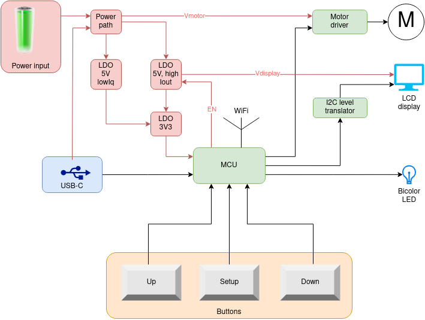

Original version of this repository is at [LieBtrau/chickenguard-2019-upgrade](https://github.com/LieBtrau/chickenguard-2019-upgrade).

# chickenguard-2019-upgrade

## Use case 1 : ChickenGuard, 2019 version no longer functions correctly
Replace original electronics with open source, easy-to-repair hardware.

## Use case 2 : Build it all yourself
1. Buy a chicken door 
  * [Self-locking](https://automatische-kippendeur-opener.nl/winkel/kippendeur/zelfsluitende-kippendeur-van-chickenguard/) : €49
  * [Standard](https://automatische-kippendeur-opener.nl/winkel/kippendeur/aluminium-kippendeur-met-2-geleiders/) : €20
2. Buy a DC-motor
  * Chickenguard uses the [SG-27063800-187K](https://www.alibaba.com/product-detail/SG-27-DC-gear-motor-gear_425835308.html) : €4/pce.  It's made by Ningbo Shengguang Motor Co. Ltd., Ningbo Leison Co. Ltd. (partnr. LS-SG27), ...    
  * [LS-25GA370-103](https://www.nbleisonmotor.com/LS-25GA370-Dc-Gear-Motor-pd6387204.html) has the same torque and voltage, but not the same dimensions.  This one might be easier available (e.g. [otronic](https://www.otronic.nl/nl/reductiemotor-6v-dc-77rpm-25ga-370.html))
3. Buy a housing
  * [Bopla XT 120805 WL 7035](https://www.bopla.de/en/enclosure-technology/euromas-x/abs-single-colour-with-wall-brackets/enclosure-abs-with-wall-brackets/xt-120805-wl-7035) 
  * [Hammond 1555FF42GY](https://www.hammfg.com/files/parts/pdf/1555FF42GY.pdf)
  * [Fibox 7083580](https://www.fibox.nl/catalog/1999/product/640/7083580_HOL1.html)

## Documentation

* [Product Requirement Document](./docs/PRD.md)
* [Concept](./docs/concept.md)
* [Technical study](./docs/technical-study.ipynb)

## Prior Art
* [Peno64 ChickenGuard](https://github.com/peno64/ChickenGuard/blob/master/ChickenGuard.ino)
* [JP_chickenDoor](https://github.com/f2knpw/JP_chickenDoor/blob/master/JP_ESP32_ChickenDoor_wifi_IRsensor_Arduino.ino)
* [ChickenGuard](https://www.chickenguard.be/)
  * Uses an 8bit MCU (PIC18F14K22), an external RTC with 32.768kHz crystal and an SOIC8 motor driver.