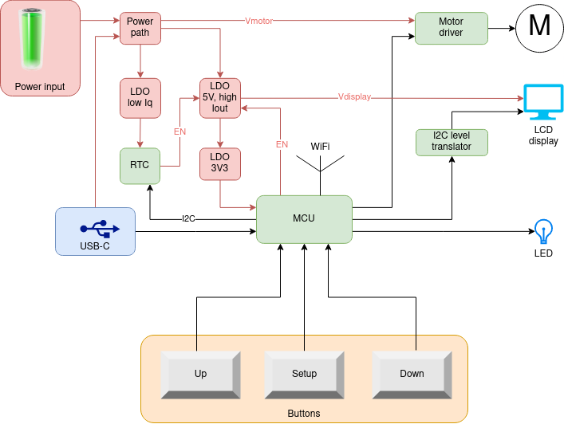

# Electronics

## Motor driver
MCU can't deliver enough current.  Added features such a measuring motor current.

## Power
### Battery
* 4xAA battery : cheap, readily available, easy to replace

### USB-C
* It will be used in 5V mode.  230V to USB-C adapter is readily available.

### Power path
This includes logic so that only one power source is active at a time.  No current can flow from one power source to the other.

### LDO low Iq
* Because the RTC can't directly be powered by the battery, a low Iq LDO is needed.

### LDO 5V, high current
* This LDO serves two purposes.  It is a pre-regulator for the 3V3-LDO, while at the same time providing 5V to the display.
* By only enabling the display when needed, a lot of power can be saved.

### 3V3 LDO to MCU
* The MCU can draw up to 350mA
* The LDO should have a low quiescent current (low Iq) while at the same time allowing for 350mA output current.
* Such an LDO typically has a low input voltage (<5.5V), so it can't be connected directly to the battery.  That's why the aforementioned LDOs are used.

## MCU
An MCU is needed with Wifi, RTC and low sleep currents.

## Display
The 16x2 display will be reused.  The display requires 5V to operate.

## I2C level translator
As the display needs 5V and it has a parallel interface, this would occupy lots of MCU-pins.  Moreover, a lot of level translators would be needed between the display and the MCU.  
Alternatively, an I²C-IO-expander will be used, powered from 5V.  Now, only the two I²C-lines need to be level translated.

## Buttons
3 standard momentary push buttons.

## LED
Single color red, or bicolor red-green

## RTC
* The ESP32 has an internal RTC, but it can only be enabled in ESP-IDF, not in PlatformIO.  This is a problem, as the ESP-IDF is not compatible with the Arduino framework and libraries.
* An external RTC comes to the rescue.